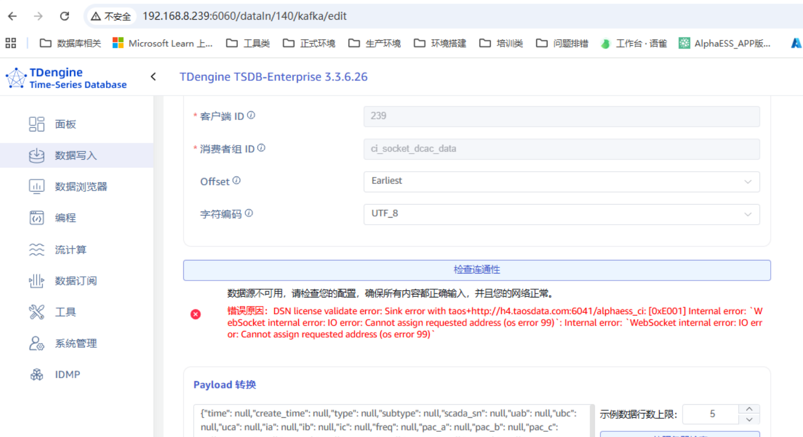

执行命令：

```

./target2/debug/taos-explorer -x http://taosx:6050 -c http://td1:6041 >3.log 2>&1 &


./target2/debug/taos-explorer -x http://taosx:6050 -c http://td1:6041 

./target2/debug/taos-explorer -x http://172.21.0.2:6050 -c http://172.21.0.2:6041 -g http://172.21.0.2:6055

```

页面开发测试：

```
pnpm run dev

```


问题：



重点还是要看看 os error 99 是什么含义，查到 os error 99 含义：

```
绑定了本机不存在的 IP 地址
典型例子：在云服务器代码里把监听地址写成公网 IP，而内核只能识别内网 IP，于是 bind 失败
app.run(host="公网IP", port=8080) → OSError: [Errno 99] …
```


了解 os error 99 含义后，就知道是 ip地址的问题了，这个： h4.taosdata.com  找不到 ip 地址，应该是 DNS 没有配置或者 /etc/hosts 里没有做配置。


td2csv:

```
taosx run --from "taos://192.168.2.131:6030/zgc?query=select * from agent_meters" --to "file:/root/zgc/dev/agent_meters.csv"

```

csv2td:

```
taosx run -f "csv:/root/zgc/dev/agent_meters.csv" -t "taos://192.168.2.131:6030/testdb  -p "@./parser_json/csv-parser.json"
```


csv-parser.json

```
{
  "parse": {
    "ts": { "as": "TIMESTAMP(ms)" },
    "id": { "as": "INT" },
    "voltage": { "as": "INT" },
    "groupid": { "as": "INT" },
    "location": { "as": "VARCHAR(24)" }
  },
  "model": {
    "name": "${tbname}",
    "using": "meters",
    "tags": ["groupid", "location"],
    "columns": ["ts", "id", "voltage"]
  }
}
```


td2local:

```
taosx run --from "taos://192.168.2.131:6030/zgc?query=select * from agent_meters" --to "file:/root/zgc/dev/agent_meters.csv"

```
