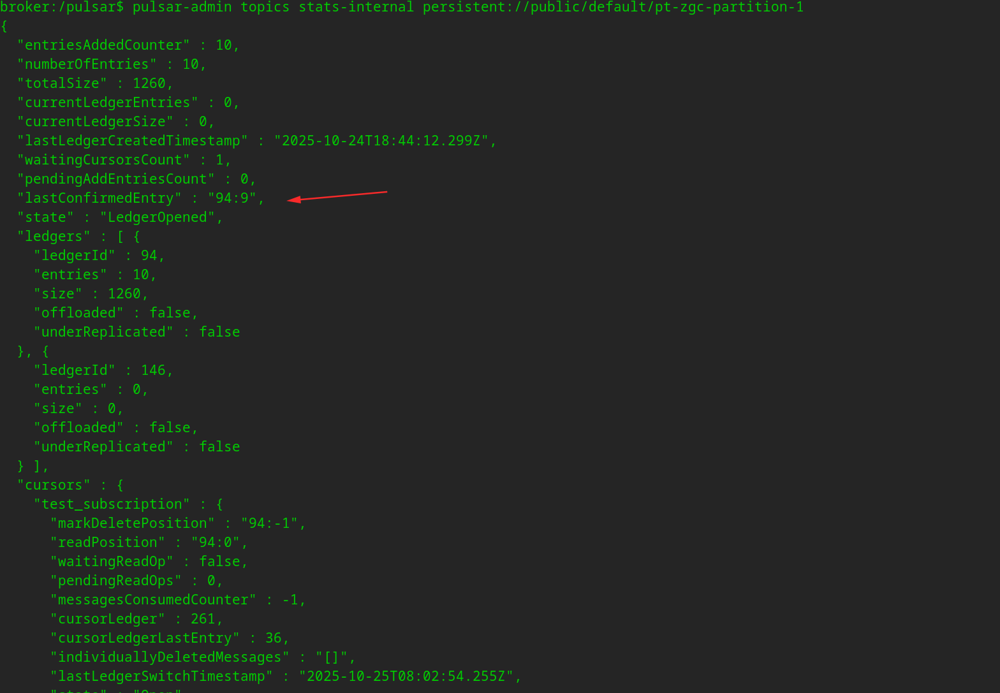

基础参数

1. subscription_name: 必须使用，需要根据 partition 来拆分任务吗？如果并发去消费？
   任务数量有限制吗? share 模式下，pulsar 理论应该上应该没有限制
2. topic_name: 必须，
3. tls: 是否需要开启 tls 认证？
4. subscription 概念类似 kafka 的 consumer group
5. partitioned topic: 正常一个 topic 只能被一个 broker 支持，这可能限制吞吐； partition topic 是可以被一组 broker 支持；

## 基本使用

python 访问 pulsar 示例:

```
pip install pulsar-client
```

consumer:

```
import pulsar

client = pulsar.Client('pulsar://localhost:6650')
consumer = client.subscribe('my-topic', subscription_name='my-sub')

while True:
    msg = consumer.receive()
    print("Received message: '%s'" % msg.data())
    consumer.acknowledge(msg)

client.close()
```

producer:

```
import pulsar

client = pulsar.Client('pulsar://localhost:6650')
producer = client.create_producer('my-topic')

for i in range(10):
    producer.send(('hello-pulsar-%d' % i).encode('utf-8'))

client.close()
```

refer:
https://pulsar.apache.org/docs/4.1.x/getting-started-docker/

### 命令行使用

登录进入 broker 添加topic:

```
pulsar-admin topics create-partitioned-topic \
    persistent://public/default/pt-zgc \
    --partitions 12
```

查看 订阅 cursor 位置:

```
# 持久化订阅
pulsar-admin topics stats persistent://public/default/pt-zgc-partition-1


# 非持久化订阅
bin/pulsar-admin topics stats-non-persistent non-persistent://public/default/your-topic -s your-sub
```

stats-internal 可以看到具体 subscription 的 cursor 信息:
pulsar-admin topics stats-internal persistent://public/default/pt-zgc-partition-1

```
broker:/pulsar$ pulsar-admin topics stats-internal persistent://public/default/pt-zgc-partition-1
{
  "entriesAddedCounter" : 10,
  "numberOfEntries" : 10,
  "totalSize" : 1260,
  "currentLedgerEntries" : 0,
  "currentLedgerSize" : 0,
  "lastLedgerCreatedTimestamp" : "2025-10-24T18:44:12.299Z",
  "waitingCursorsCount" : 2,
  "pendingAddEntriesCount" : 0,
  "lastConfirmedEntry" : "94:9",
  "state" : "LedgerOpened",
  "ledgers" : [ {
    "ledgerId" : 94,
    "entries" : 10,
    "size" : 1260,
    "offloaded" : false,
    "underReplicated" : false
  }, {
    "ledgerId" : 146,
    "entries" : 0,
    "size" : 0,
    "offloaded" : false,
    "underReplicated" : false
  } ],
  "cursors" : {
    "test_subscription" : {
      "markDeletePosition" : "94:9",
      "readPosition" : "94:10",
      "waitingReadOp" : true,
      "pendingReadOps" : 0,
      "messagesConsumedCounter" : 9,
      "cursorLedger" : 261,
      "cursorLedgerLastEntry" : 31,
      "individuallyDeletedMessages" : "[]",
      "lastLedgerSwitchTimestamp" : "2025-10-25T08:02:54.255Z",
      "state" : "Open",
      "active" : true,
      "numberOfEntriesSinceFirstNotAckedMessage" : 1,
      "totalNonContiguousDeletedMessagesRange" : 0,
      "subscriptionHavePendingRead" : true,
      "subscriptionHavePendingReplayRead" : false,
      "properties" : { }
    },
    "taosx-test" : {
      "markDeletePosition" : "94:3",
      "readPosition" : "94:5",
      "waitingReadOp" : false,
      "pendingReadOps" : 0,
      "messagesConsumedCounter" : 4,
      "cursorLedger" : 242,
      "cursorLedgerLastEntry" : 0,
      "individuallyDeletedMessages" : "[]",
      "lastLedgerSwitchTimestamp" : "2025-10-25T06:42:54.254Z",
      "state" : "Open",
      "active" : false,
      "numberOfEntriesSinceFirstNotAckedMessage" : 2,
      "totalNonContiguousDeletedMessagesRange" : 0,
      "subscriptionHavePendingRead" : false,
      "subscriptionHavePendingReplayRead" : false,
      "properties" : { }
    },
    "s1" : {
      "markDeletePosition" : "94:8",
      "readPosition" : "94:10",
      "waitingReadOp" : true,
      "pendingReadOps" : 0,
      "messagesConsumedCounter" : 9,
      "cursorLedger" : 259,
      "cursorLedgerLastEntry" : 0,
      "individuallyDeletedMessages" : "[]",
      "lastLedgerSwitchTimestamp" : "2025-10-25T07:50:54.254Z",
      "state" : "Open",
      "active" : true,
      "numberOfEntriesSinceFirstNotAckedMessage" : 2,
      "totalNonContiguousDeletedMessagesRange" : 0,
      "subscriptionHavePendingRead" : true,
      "subscriptionHavePendingReplayRead" : false,
      "properties" : { }
    }
  },
  "schemaLedgers" : [ {
    "ledgerId" : 17,
    "entries" : 1,
    "size" : 102,
    "offloaded" : false,
    "underReplicated" : false
  } ],
  "compactedLedger" : {
    "ledgerId" : -1,
    "entries" : -1,
    "size" : -1,
    "offloaded" : false,
    "underReplicated" : false
  }
}
```

具体执行：

```
broker:/pulsar$ pulsar-admin topics stats persistent://public/default/pt-zgc-partition-1
{
  "msgRateIn" : 0.0,
  "msgThroughputIn" : 0.0,
  "msgRateOut" : 0.0,
  "msgThroughputOut" : 0.0,
  "bytesInCounter" : 1260,
  "msgInCounter" : 10,
  "systemTopicBytesInCounter" : 0,
  "bytesOutCounter" : 8694,
  "msgOutCounter" : 69,
  "bytesOutInternalCounter" : 0,
  "averageMsgSize" : 0.0,
  "msgChunkPublished" : false,
  "storageSize" : 1260,
  "backlogSize" : 756,
  "backlogQuotaLimitSize" : -1,
  "backlogQuotaLimitTime" : -1,
  "oldestBacklogMessageAgeSeconds" : 51983,
  "oldestBacklogMessageSubscriptionName" : "taosx-test",
  "publishRateLimitedTimes" : 0,
  "earliestMsgPublishTimeInBacklogs" : 0,
  "offloadedStorageSize" : 0,
  "lastOffloadLedgerId" : 0,
  "lastOffloadSuccessTimeStamp" : 0,
  "lastOffloadFailureTimeStamp" : 0,
  "ongoingTxnCount" : 0,
  "abortedTxnCount" : 0,
  "committedTxnCount" : 0,
  "publishers" : [ ],
  "waitingPublishers" : 0,
  "subscriptions" : {
    "test_subscription" : {
      "msgRateOut" : 0.0,
      "msgThroughputOut" : 0.0,
      "bytesOutCounter" : 7560,
      "msgOutCounter" : 60,
      "msgRateRedeliver" : 0.0,
      "messageAckRate" : 0.0,
      "chunkedMessageRate" : 0.0,
      "msgBacklog" : 1,
      "backlogSize" : 0,
      "earliestMsgPublishTimeInBacklog" : 0,
      "msgBacklogNoDelayed" : 1,
      "blockedSubscriptionOnUnackedMsgs" : false,
      "msgDelayed" : 0,
      "msgInReplay" : 0,
      "unackedMessages" : 0,
      "type" : "Failover",
      "activeConsumerName" : "test_consumer9",
      "msgRateExpired" : 0.0,
      "msgExpired" : 0,
      "totalMsgExpired" : 0,
      "lastExpireTimestamp" : 0,
      "lastConsumedFlowTimestamp" : 1761383019060,
      "lastConsumedTimestamp" : 1761383019961,
      "lastAckedTimestamp" : 1761383046982,
      "lastMarkDeleteAdvancedTimestamp" : 1761383046983,
      "consumers" : [ {
        "msgRateOut" : 0.0,
        "msgThroughputOut" : 0.0,
        "bytesOutCounter" : 1260,
        "msgOutCounter" : 10,
        "msgRateRedeliver" : 0.0,
        "messageAckRate" : 0.0,
        "chunkedMessageRate" : 0.0,
        "consumerName" : "test_consumer9",
        "availablePermits" : 990,
        "unackedMessages" : 0,
        "avgMessagesPerEntry" : 1,
        "blockedConsumerOnUnackedMsgs" : false,
        "drainingHashesCount" : 0,
        "drainingHashesClearedTotal" : 0,
        "drainingHashesUnackedMessages" : 0,
        "address" : "/172.21.0.1:36280",
        "connectedSince" : "2025-10-25T09:03:39.018756859Z",
        "clientVersion" : "pulsar-rs-v6.4.1",
        "lastAckedTimestamp" : 1761383046982,
        "lastConsumedTimestamp" : 1761383019961,
        "firstMessagesSentTimestamp" : 1761383019962,
        "lastConsumedFlowTimestamp" : 1761383019060,
        "firstConsumedFlowTimestamp" : 1761383019060,
        "metadata" : { },
        "lastAckedTime" : "2025-10-25T09:04:06.982Z",
        "lastConsumedTime" : "2025-10-25T09:03:39.961Z"
      } ],
      "isDurable" : true,
      "isReplicated" : false,
      "allowOutOfOrderDelivery" : false,
      "consumersAfterMarkDeletePosition" : { },
      "drainingHashesCount" : 0,
      "drainingHashesClearedTotal" : 0,
      "drainingHashesUnackedMessages" : 0,
      "nonContiguousDeletedMessagesRanges" : 0,
      "nonContiguousDeletedMessagesRangesSerializedSize" : 0,
      "delayedMessageIndexSizeInBytes" : 0,
      "subscriptionProperties" : { },
      "filterProcessedMsgCount" : 0,
      "filterAcceptedMsgCount" : 0,
      "filterRejectedMsgCount" : 0,
      "filterRescheduledMsgCount" : 0,
      "dispatchThrottledMsgEventsBySubscriptionLimit" : 0,
      "dispatchThrottledBytesEventsBySubscriptionLimit" : 0,
      "dispatchThrottledMsgEventsByTopicLimit" : 0,
      "dispatchThrottledBytesEventsByTopicLimit" : 0,
      "dispatchThrottledMsgEventsByBrokerLimit" : 0,
      "dispatchThrottledBytesEventsByBrokerLimit" : 0,
      "durable" : true,
      "replicated" : false
    },
    "taosx-test" : {
      "msgRateOut" : 0.0,
      "msgThroughputOut" : 0.0,
      "bytesOutCounter" : 504,
      "msgOutCounter" : 4,
      "msgRateRedeliver" : 0.0,
      "messageAckRate" : 0.0,
      "chunkedMessageRate" : 0.0,
      "msgBacklog" : 6,
      "backlogSize" : 756,
      "earliestMsgPublishTimeInBacklog" : 0,
      "msgBacklogNoDelayed" : 6,
      "blockedSubscriptionOnUnackedMsgs" : false,
      "msgDelayed" : 0,
      "msgInReplay" : 0,
      "unackedMessages" : 0,
      "type" : "Failover",
      "msgRateExpired" : 0.0,
      "msgExpired" : 0,
      "totalMsgExpired" : 0,
      "lastExpireTimestamp" : 0,
      "lastConsumedFlowTimestamp" : 1761320601544,
      "lastConsumedTimestamp" : 0,
      "lastAckedTimestamp" : 0,
      "lastMarkDeleteAdvancedTimestamp" : 0,
      "consumers" : [ ],
      "isDurable" : true,
      "isReplicated" : false,
      "allowOutOfOrderDelivery" : false,
      "consumersAfterMarkDeletePosition" : { },
      "drainingHashesCount" : 0,
      "drainingHashesClearedTotal" : 0,
      "drainingHashesUnackedMessages" : 0,
      "nonContiguousDeletedMessagesRanges" : 0,
      "nonContiguousDeletedMessagesRangesSerializedSize" : 0,
      "delayedMessageIndexSizeInBytes" : 0,
      "subscriptionProperties" : { },
      "filterProcessedMsgCount" : 0,
      "filterAcceptedMsgCount" : 0,
      "filterRejectedMsgCount" : 0,
      "filterRescheduledMsgCount" : 0,
      "dispatchThrottledMsgEventsBySubscriptionLimit" : 0,
      "dispatchThrottledBytesEventsBySubscriptionLimit" : 0,
      "dispatchThrottledMsgEventsByTopicLimit" : 0,
      "dispatchThrottledBytesEventsByTopicLimit" : 0,
      "dispatchThrottledMsgEventsByBrokerLimit" : 0,
      "dispatchThrottledBytesEventsByBrokerLimit" : 0,
      "durable" : true,
      "replicated" : false
    },
    "s1" : {
      "msgRateOut" : 0.0,
      "msgThroughputOut" : 0.0,
      "bytesOutCounter" : 630,
      "msgOutCounter" : 5,
      "msgRateRedeliver" : 0.0,
      "messageAckRate" : 0.0,
      "chunkedMessageRate" : 0.0,
      "msgBacklog" : 1,
      "backlogSize" : 126,
      "earliestMsgPublishTimeInBacklog" : 0,
      "msgBacklogNoDelayed" : 1,
      "blockedSubscriptionOnUnackedMsgs" : false,
      "msgDelayed" : 0,
      "msgInReplay" : 0,
      "unackedMessages" : 0,
      "type" : "Failover",
      "activeConsumerName" : "c1",
      "msgRateExpired" : 0.0,
      "msgExpired" : 0,
      "totalMsgExpired" : 0,
      "lastExpireTimestamp" : 0,
      "lastConsumedFlowTimestamp" : 1761320710883,
      "lastConsumedTimestamp" : 1761321567596,
      "lastAckedTimestamp" : 1761321537399,
      "lastMarkDeleteAdvancedTimestamp" : 1761321537401,
      "consumers" : [ {
        "msgRateOut" : 0.0,
        "msgThroughputOut" : 0.0,
        "bytesOutCounter" : 630,
        "msgOutCounter" : 5,
        "msgRateRedeliver" : 0.0,
        "messageAckRate" : 0.0,
        "chunkedMessageRate" : 0.0,
        "consumerName" : "c1",
        "availablePermits" : 995,
        "unackedMessages" : 0,
        "avgMessagesPerEntry" : 1,
        "blockedConsumerOnUnackedMsgs" : false,
        "drainingHashesCount" : 0,
        "drainingHashesClearedTotal" : 0,
        "drainingHashesUnackedMessages" : 0,
        "address" : "/172.21.0.1:40310",
        "connectedSince" : "2025-10-24T15:45:10.882816886Z",
        "clientVersion" : "pulsar-rs-v6.4.1",
        "lastAckedTimestamp" : 1761321537399,
        "lastConsumedTimestamp" : 1761321567596,
        "firstMessagesSentTimestamp" : 1761320764551,
        "lastConsumedFlowTimestamp" : 1761320710883,
        "firstConsumedFlowTimestamp" : 1761320710883,
        "metadata" : { },
        "lastAckedTime" : "2025-10-24T15:58:57.399Z",
        "lastConsumedTime" : "2025-10-24T15:59:27.596Z"
      } ],
      "isDurable" : true,
      "isReplicated" : false,
      "allowOutOfOrderDelivery" : false,
      "consumersAfterMarkDeletePosition" : { },
      "drainingHashesCount" : 0,
      "drainingHashesClearedTotal" : 0,
      "drainingHashesUnackedMessages" : 0,
      "nonContiguousDeletedMessagesRanges" : 0,
      "nonContiguousDeletedMessagesRangesSerializedSize" : 0,
      "delayedMessageIndexSizeInBytes" : 0,
      "subscriptionProperties" : { },
      "filterProcessedMsgCount" : 0,
      "filterAcceptedMsgCount" : 0,
      "filterRejectedMsgCount" : 0,
      "filterRescheduledMsgCount" : 0,
      "dispatchThrottledMsgEventsBySubscriptionLimit" : 0,
      "dispatchThrottledBytesEventsBySubscriptionLimit" : 0,
      "dispatchThrottledMsgEventsByTopicLimit" : 0,
      "dispatchThrottledBytesEventsByTopicLimit" : 0,
      "dispatchThrottledMsgEventsByBrokerLimit" : 0,
      "dispatchThrottledBytesEventsByBrokerLimit" : 0,
      "durable" : true,
      "replicated" : false
    }
  },
  "replication" : { },
  "deduplicationStatus" : "Disabled",
  "nonContiguousDeletedMessagesRanges" : 0,
  "nonContiguousDeletedMessagesRangesSerializedSize" : 0,
  "delayedMessageIndexSizeInBytes" : 0,
  "compaction" : {
    "lastCompactionRemovedEventCount" : 0,
    "lastCompactionSucceedTimestamp" : 0,
    "lastCompactionFailedTimestamp" : 0,
    "lastCompactionDurationTimeInMills" : 0
  },
  "ownerBroker" : "broker:8080",
  "topicCreationTimeStamp" : 1761280295889,
  "lastPublishTimeStamp" : 1761321567588
}


```

代码：

```
let latest_id_data = MessageIdData {
        ledger_id: u64::MAX,
        entry_id: u64::MAX,
        ..Default::default()
    };
    // let latest_id_data  = last_msg_id;
    consumer.seek(Some(consumer.topics()), Some(latest_id_data.clone()), None, pulsar).await?;
    log::info!("seek to latest_id_data: {:?}", latest_id_data);
```

对应的cursor:

```
"cursors" : {
    "test_subscription" : {
      "markDeletePosition" : "94:-1",
      "readPosition" : "94:0",
      "waitingReadOp" : false,
      "pendingReadOps" : 0,
      "messagesConsumedCounter" : -1,
      "cursorLedger" : 261,
      "cursorLedgerLastEntry" : 36,
      "individuallyDeletedMessages" : "[]",
      "lastLedgerSwitchTimestamp" : "2025-10-25T08:02:54.255Z",
      "state" : "Open",
      "active" : false,
      "numberOfEntriesSinceFirstNotAckedMessage" : 1,
      "totalNonContiguousDeletedMessagesRange" : 0,
      "subscriptionHavePendingRead" : false,
      "subscriptionHavePendingReplayRead" : false,
      "properties" : { }
    },
```

图中的 lastConfirmedEntry 应该是代码的返回值：

```
let last_msg_id = consumer.get_last_message_id().await?;
```

因为测试发现，不论 scription name: test_subscription 的 makrDeletePosition 和 readPosition 怎么变化，都不影响 get_last_message_id() 的返回值信息。

即使换另外一个订阅名： test_subscription2， 函数：get_last_message_id() 返回的依旧是 94:9 的位置。

图：



## 测试命令

```
cargo test --package source-pulsar --lib -- config::connect::tests::test_parse_broker_url --exact --show-output --nocapture
```

## 依赖组件

```
apt-get install protobuf-compiler
```

## todo

### 需要添加表

information_schema.ins_grants_full 里添加 pulsar 的支持；

```
select `limits` from {} where grant_name='{connector}'

select `limits` from information_schema.ins_grants_full where grant_name='pulsar';
select `limits` from information_schema.ins_grants_full where grant_name='kafka';
```

### 现有todo

20251025

1. 少量数据滞留问题, 少量数据会滞留，不会发送出去
2. breakpoint 如何做？
3. metrics 如何做？(done)
4. 后续是否需要需要改为 shared 模式？
5. 测试用例 **
6. jwt_token, basic_auth, mtls 测试 **
7. 任务列表页面 list 上，似乎不可以选择任务 **


pulsar-rs bug:

1. exclude 模式下，seek 会死循环
2. seek 使用 u64::MAX 不能推到最新的 data record

其他：

1. 确认 pular-rs 还有其他的方式获取当前 topic 的最新的 ledger_id 和 entry_id 吗
2. pulsar-rs 研究下代码和设计


## 测试数据

```
{"ts":1761320604889,"id":0,"v_str":"255044462D312E330D0A","groupid":0,"location":"BeiJing"} {"ts":1761320605896,"id":1,"v_str":"255044462D312E330D0A","groupid":1,"location":"BeiJing"} {"ts":1761320606911,"id":2,"v_str":"255044462D312E330D0A","groupid":2,"location":"BeiJing"} {"ts":1761320607924,"id":0,"v_str":"255044462D312E330D0A","groupid":0,"location":"BeiJing"} {"ts":1761320608935,"id":1,"v_str":"255044462D312E330D0A","groupid":1,"location":"BeiJing"}
```


## 问题

那么为什么 pulsar 的 java/c++ 客户端都会要求提供 ca.cert.pem 文件？为什么 pulsar-rs 里不用？
Java/C++ 客户端把 根证书选择权 暴露给用户（可自定义 CA、可开关系统根库）；
pulsar-rs 则直接把 根证书验证 交给 操作系统（或 rustls-native-certs），不再提供自定义 CA 的入口，因此代码里看不到 ca.cert.pem 参数。

4. 如果我真的要用私有 CA？
   权宜办法：
   把私有根证书 导入系统信任库（update-ca-trust、keychain、certutil 等）；
   或者 反向代理层（Pulsar Proxy）做 TLS 终结，Rust 侧只连 Proxy 的公共 CA 端口；
   等待 pulsar-rs 后续版本 暴露 root_certificates 参数。
   一句话总结
   Java/C++ 把 “信任谁” 交给用户，所以让你传 ca.cert.pem；
   pulsar-rs 目前 强制使用操作系统根证书池，不暴露自定义 CA 入口，因此代码里看不到根证书文件——不是不需要，而是“由系统代管”。
