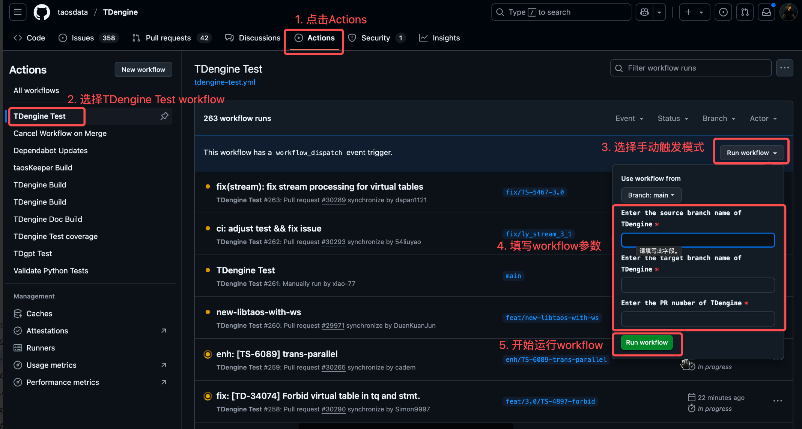

相关问题：

1. 一定要问清楚每个没有过的 CI 是否与自己的代码有关系，尤其是 tmsg.h, tdef.h 等公用文件，以及 枚举值 的类型
2. 内存泄露问题不是大问题，但是需要尽快解决，尤其影响别人的 CI 流程的


TDinternal 环境安装：

```
apt install python3.10-venv

cd /app/TDinternal/community/test

python3 -m venv .venv

# 激活
source .venv/bin/activate

使用 uv 安装，不使用 pip3 安装 pip3 install -r requirements.txt 
uv 安装：
uv pip install -r requirements.txt


cd /app/TDinternal/community/test
pytest cases/42-Xnode/test_xnode.py -q

# 显示 debug 打印信息：
LD_PRELOAD=/usr/lib/x86_64-linux-gnu/libasan.so.6 pytest --log-cli-level=DEBUG cases/42-Xnode/test_xnode.py -q

只跑某个函数：
pytest cases/42-Xnode/test_xnode.py::TestXnode::test_show_primitives -q

如果改了 pytest 代码没有生效，注意删除 pytest 的缓存：
cd /app/TDinternal/community/test
rm -rf .pytest_cache/

或者执行：pytest --cache-clear
```


第一种：

```
rm -rf ../sim/*
./ci/pytest.sh pytest cases/42-Xnode/test_xnode.py --clean


./ci/pytest.sh pytest cases/42-Xnode/test_xnode.py::TestXnode::test_alter_token
```


第二种：

```
rm -rf ../sim/*
LD_PRELOAD=/usr/lib/x86_64-linux-gnu/libasan.so.6 pytest --log-cli-level=DEBUG cases/42-Xnode/test_xnode.py::TestXnode::test_alter_userpass -q

LD_PRELOAD=/usr/lib/x86_64-linux-gnu/libasan.so.6 pytest --log-cli-level=DEBUG cases/42-Xnode/test_xnode.py -q
```


相关测试：

同时提交 TDinternal 和 TDengine 的时候，需要使用手动触发的方式才可以跑 TDengine Test 的测试。

手动触发方式，需要在标题中增加标记：[manual-only] ，这样可以跳过自动的 pr 的测试。效果如下：

具体步骤：




refer:

https://taosdata.feishu.cn/wiki/DnKCwivMhivMl4k4QLGce86AnVb


