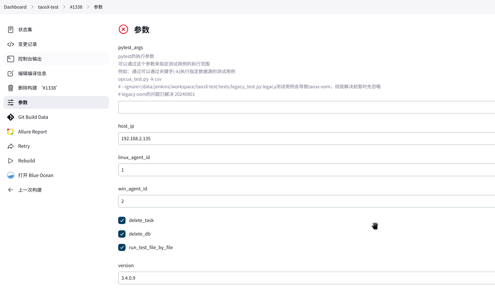

```
执行一次，将 git 账号保存下来：
git config --global credential.helper store
git clone https://<token>@github.com/taosdata/TestNG_taosX.git /tmp/test
再执行：
poetry install --no-root
```


环境准备：

```
cp setenv.sh.example setenv.sh
# Change HOST to your test env ip or fqdn. We can just use localhost for local test.
source setenv.sh
```

执行测试：

```
poetry run pytest /path/to/test_function/tmq_test.py::test_sanity

# 跑所有 case
poetry run pytest test_function/csv_test.py

# 只跑某个 case 
poetry run pytest test_function/csv_test.py::test_sanity_csv_td32576_01

poetry run pytest --log-cli-level=DEBUG test_function/csv_test.py::test_sanity_csv_td32576_01
```


poetry 改为开发模式，从新安装：

修改文件： pyproject.toml

```
testng-taosx = { path = "../../../TestNG_taosX", develop = true }

poetry lock --no-update

poetry install --no-root

# 跑某个 case 验证
poetry run pytest test_function/csv_test.py::test_sanity_csv_td32576_01


```


重新安装：

```
# 进入你的 e2e 项目目录
cd /root/zgc/taosx/tests/e2e

# 1. 删除旧的 git 依赖（从虚拟环境中卸载）
poetry run pip uninstall testng-taosx -y

# 2. 更新 lock 文件（必须，因为依赖类型从 git 变成了 path）
poetry lock --no-update

# 3. 重新安装（此时会以 editable 模式安装）
poetry install --no-root

poetry run python -c "import testng_taosx; print(testng_taosx.__file__)"
```


注意的是 taosx 用的是 framework-only 这个分支，如果这个分支更新了，需要 taosx e2e 的测试需要更新 testng-taosx ：

```
# 进入项目目录
cd ~/taosx/tests/e2e

# 更新特定包到最新 commit
poetry update testng-taosx
```


临时直接使用这种方式：

```
poetry add /app/TestNG_taosX --editable

poetry add /root/zgc/TestNG_taosX --editable
```


鉴权的问题, 现在 explorer 上的接口都需要加上用户名密码：

```
curl -u root:taosdata http://localhost:6060/api/x/tasks
```


指定 unix socket 访问, 查看状态：

```
curl --unix-socket /var/lib/taos.taosxnoded.sock http://localhost/xnode/1
```


 依赖 taosx 启动：

```
nohup taosx 2>&1 &
create xnode 'localhost:6055';
```


重新进入运行：

```
root@ha ~/taosx/tests/e2e (main)$ cp setenv.sh.example setenv.sh
root@ha ~/taosx/tests/e2e (main)$ source setenv.sh
root@ha ~/taosx/tests/e2e (main)$ poetry run pytest test_function/csv_test.py::test_sanity_csv_td32576_01
```


jekins 配置：



测试分支修复：

```
*/main  改为了 */chore/update-poetry-lock
```

测试完成后，需要恢复：

```
*/chore/update-poetry-lock 改为了 */main
```


