parseSqlIntoAst() -> { parse()，  analyseSemantic() }


analyseSemantic() -> { translate(),  calculateConstant() }


translate() -> { rewriteQuery(),    translateQuery() }


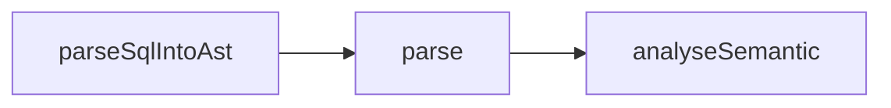


代码逻辑：

mndShow.c: 

mndProcessRetrieveSysTableReq() -> mndCreateShowObj()

这段代码说明要去找：  msg 和 sys table name 的对应逻辑, 这个关系应该在 parTranslate.c 里就已经可以找到了，否则

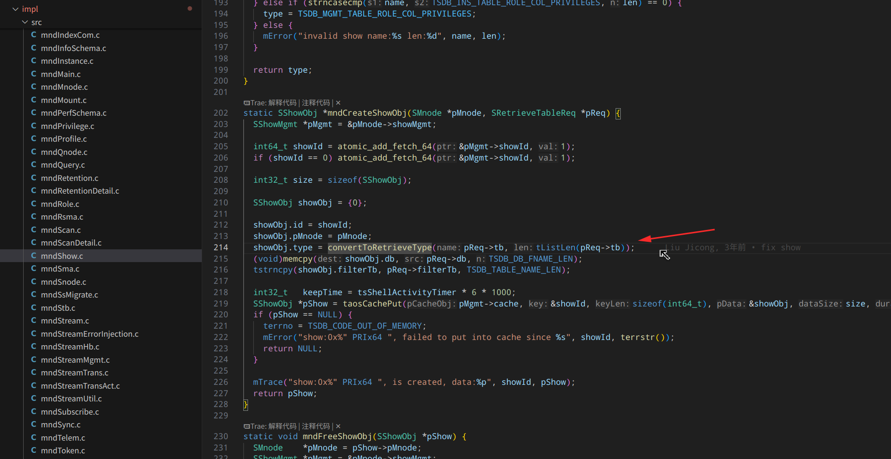


parTranslate.c 发送的消息应该是：TDMT_MND_SYSTABLE_RETRIEVE,  这个是总的消息，然后再分拆子消息到 show xnode;

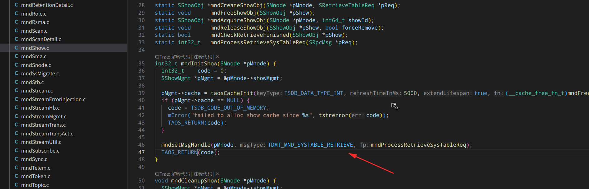


```
mndAddShowRetrieveHandle(pMnode, TSDB_MGMT_TABLE_XNODES, mndRetrieveXnodes);

void mndAddShowRetrieveHandle(SMnode *pMnode, EShowType showType, ShowRetrieveFp fp) {
  SShowMgmt *pMgmt = &pMnode->showMgmt;
  pMgmt->retrieveFps[showType] = fp;
}
```

在 mndShow.c 的 mndProcessRetrieveSysTableReq() 里使用：

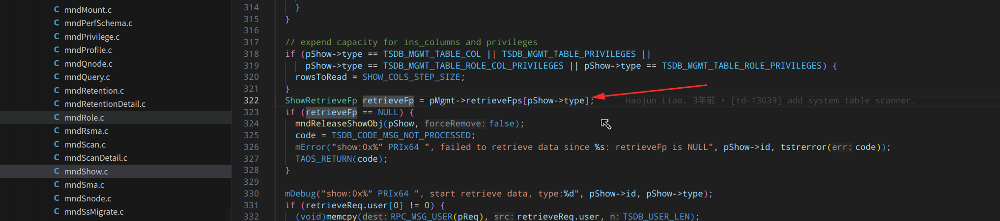


show.cpp 测试用例,  这个可以直接发送 show 的子消息，子消息在：typedef enum _mgmt_table  里定义：

```
TEST_F(MndTestShow, 02_ShowMsg_InvalidMsgStart) {
  SShowReq showReq = {0};
  showReq.type = TSDB_MGMT_TABLE_START;

  int32_t contLen = tSerializeSShowReq(NULL, 0, &showReq);
  void*   pReq = rpcMallocCont(contLen);
  tSerializeSShowReq(pReq, contLen, &showReq);
  tFreeSShowReq(&showReq);

  SRpcMsg* pRsp = test.SendReq(TDMT_MND_SYSTABLE_RETRIEVE, pReq, contLen);
  ASSERT_NE(pRsp, nullptr);
  ASSERT_NE(pRsp->code, 0);
}
```


TDMT_MND_SYSTABLE_RETRIEVE 的消息的发送是单独的，在 execute 模块里：

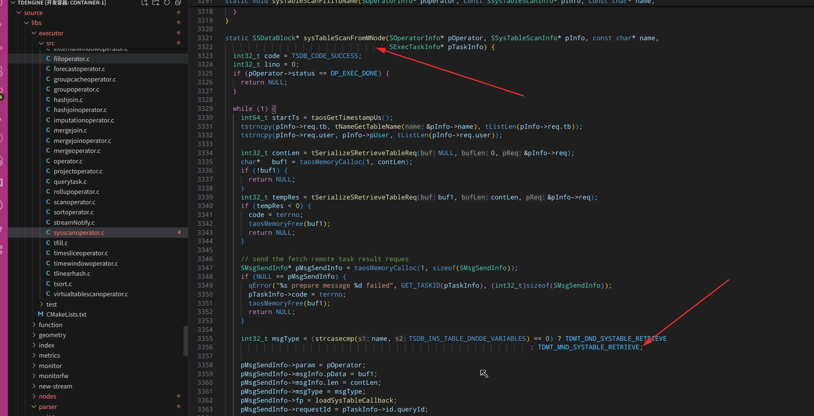


结构体 SShowStmt 是 show 命令的使用的结构体：

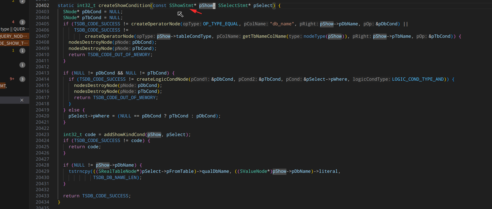


where 条件重写以后，具体是在哪里执行的？


setQuery 后走到哪一步了？

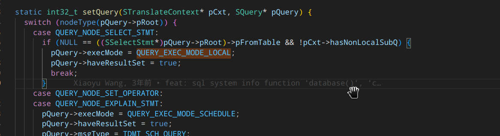


在 parShowToUse.cpp 里有使用方法：

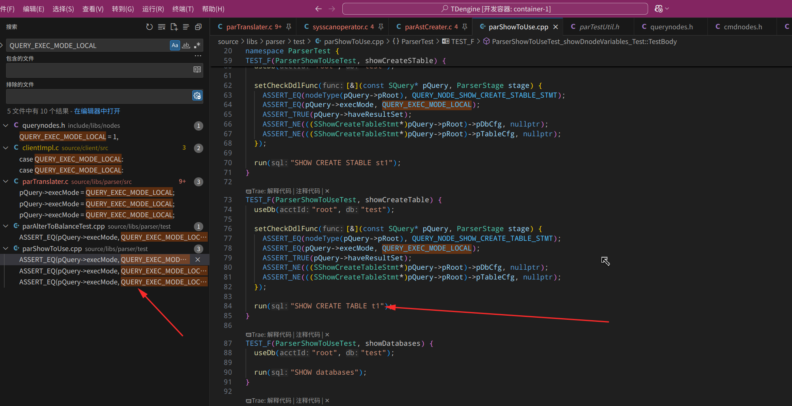


translate 后所有的信息都放到了这里：

```
typedef struct STranslateContext {
  SParseContext*   pParseCxt;
  int32_t          errCode;
  ESubQueryType    expSubQueryType;
  SMsgBuf          msgBuf;
  SArray*          pNsLevel;  // element is SArray*, the element of this subarray is STableNode*
  SNodeList*       pSubQueries; // sub queries NOT from FROM clause， SArray<SNode*>
  int32_t          currLevel;
  int32_t          levelNo;
  ESqlClause       currClause;
  SNode*           pCurrStmt;
  SCmdMsgInfo*     pCmdMsg;          // 要发送的消息都放到了这里
  SHashObj*        pDbs;
  SHashObj*        pTables;
  SHashObj*        pTargetTables;
  SExplainOptions* pExplainOpt;
  SParseMetaCache* pMetaCache;
  bool             isExprSubQ;
  bool             isCorrelatedSubQ;
  bool             hasNonLocalSubQ;
  bool             hasLocalSubQ;
  bool             stableQuery;
  bool             showRewrite;
  bool             withOpt;
  SNode*           pPrevRoot;
  SNode*           pPostRoot;
  bool             dual;  // whether select stmt without from stmt, true for without.
  bool             skipCheck;
  bool             refTable;
  SParseStreamInfo streamInfo;
} STranslateContext;
```


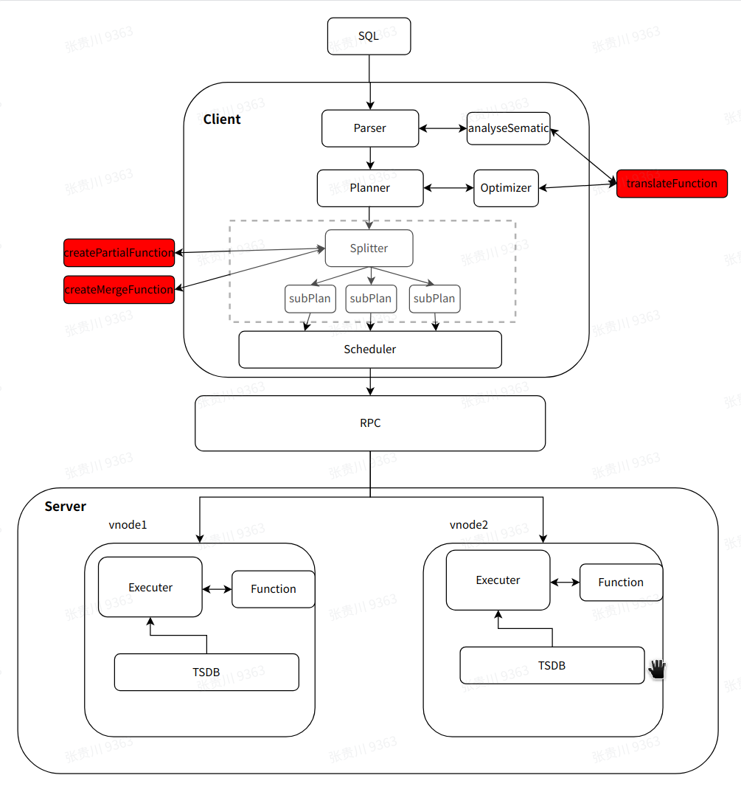

按照这个图，在planner 里打断点，异步框架的回调会走到这里, 注意左边的栈：

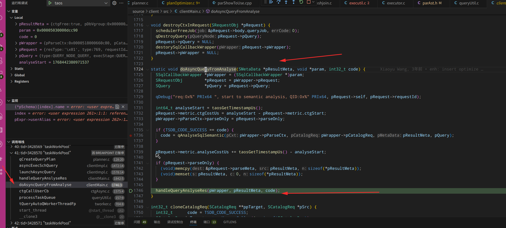


在 phaseAsyncQuery 里组装的这个函数，深入后会发现走进了 catalog 函数，catalog 里会将这个 函数 指针放到 catalog 的 job 里，这样异步 rpc 框架就可以回调到这个函数了：

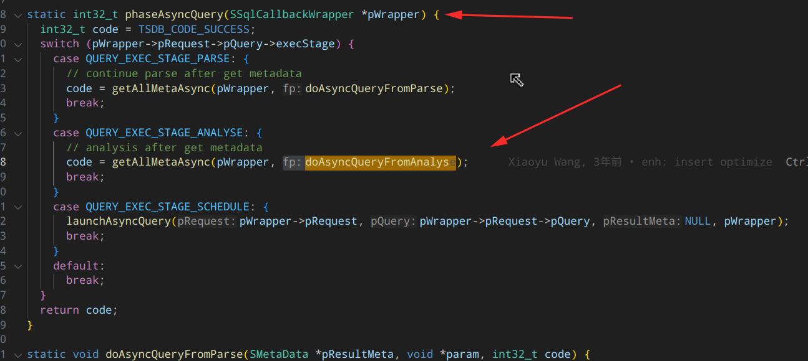


和 translate 函数一样，这里 qCreateQueryPlan 也是 plan 模块的一个总的入口：

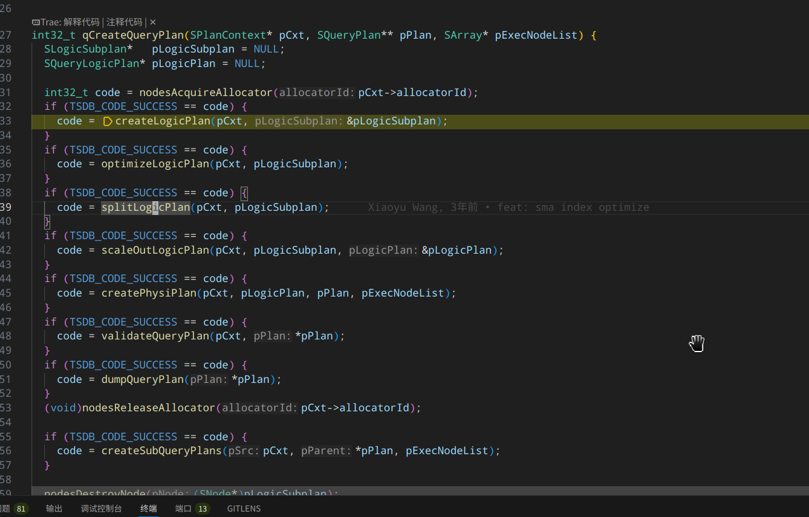


在函数：asyncExecSchQuery 里，有：

```
static int32_t asyncExecSchQuery(SRequestObj* pRequest, SQuery* pQuery, SMetaData* pResultMeta,
                                 SSqlCallbackWrapper* pWrapper) {
 
 qCreateQueryPlan();  // 先调用了 queryPlan
 ...  
 schedulerExecJob();   // 再调用了 scheduler 函数
}                                 
```

schedulerExecJob()  函数，直接就进入了 scheduler 模块了, 这个 scheduler 的功能，应该是根据 机器资源 进行任务分配执行了：

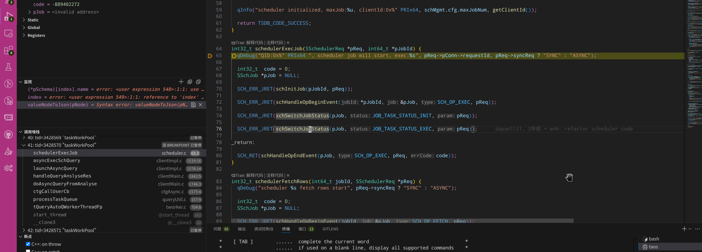


nodesRewriteSelectStmt() 应该是真正实施改写的函数：

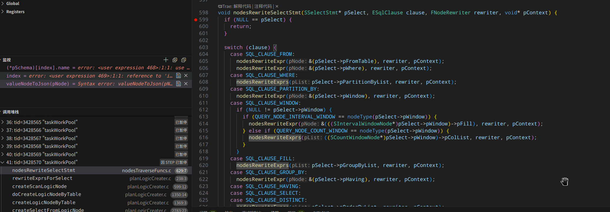


整个框架底层使用的 uv 异步框架，执行完 -> 下一个阶段的函数执行 -> ... 这样不断下去。 uv 框架的使用在 transport 层支持的；

## scheduler 模块

scheduler 模块如果设计的好，应该都是只处理 job 相关的事情，不再和 planner 等有关系了！

可能还有发送消息部分,发送消息应该都在 planner 等层组装好了，只是


#### rpc 模块：transport

transport 模块就是 rpc 模块：

1. 在 transComm.h 里使用的是 uv 来进行进行的协程异步调用！所以也会有注册所有信息的地方
2. 


客户端使用 tsem_wait 进行等待：

```
SRpcMsg* TestClient::SendReq(SRpcMsg* pReq) {
  SEpSet epSet = {0};
  addEpIntoEpSet(&epSet, tsLocalFqdn, tsServerPort);
  rpcSendRequest(clientRpc, &epSet, pReq, NULL);
  tsem_wait(&sem);
  uInfo("y response:%s from dnode, code:0x%x, msgSize: %d", TMSG_INFO(pRsp->msgType), pRsp->code, pRsp->contLen);

  return pRsp;
}
```


## executor 模块

这个模块在 tsdb 里执行，并且截图的函数获取 mnode 的表，发送消息给 mnode leader 节点进行处理！

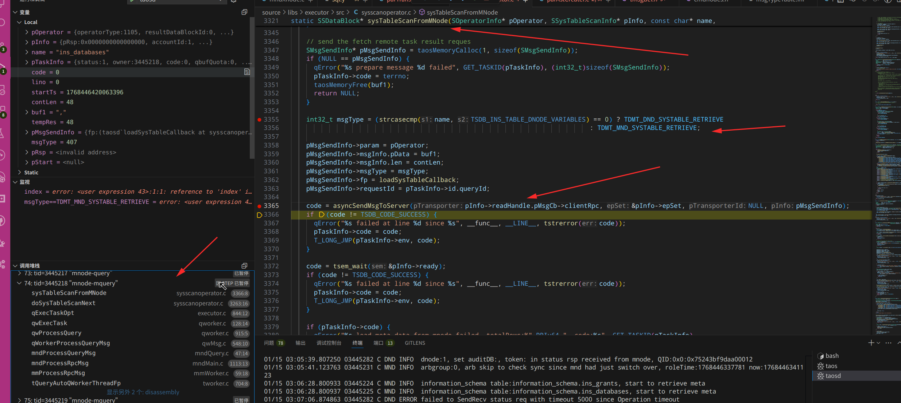


走到这里才发现：TDMT_MND_SYSTABLE_RETRIEVE 消息应该不是客户端发的，是 tsdb 的 dnode 的 executor 模块发送的，在最后的位置才将消息类型改为 TDMT_MND_SYSTABLE_RETRIEVE, 

这里通过表名判断的：

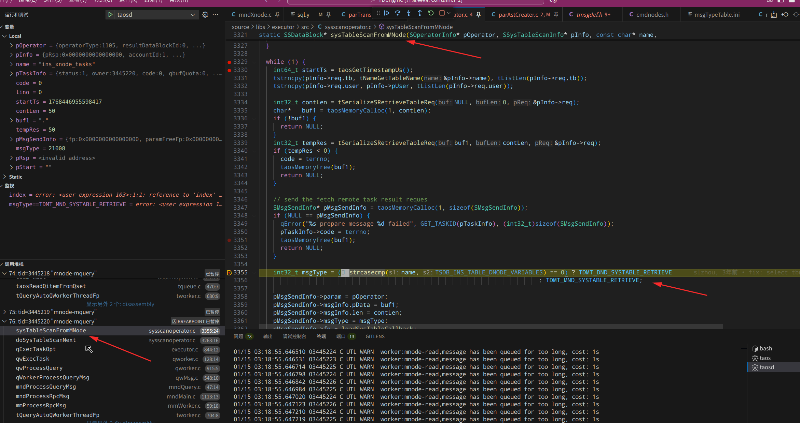

接着走到 TDMT_MND_SYSTABLE_RETRIEVE 处理 show 的消息：

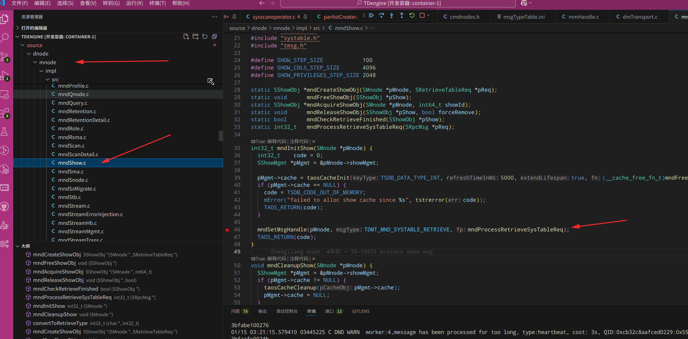


原因应该是： show 转为 select 语句处理的，所以最后在 executor 里变为 systable 这样的类型发送！


没看懂 translateWhere 是在做什么？

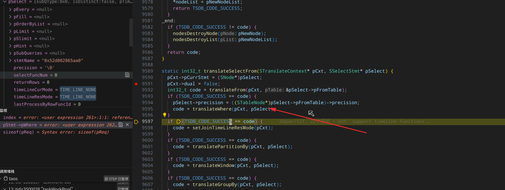


## 总结：

1. show 流程需要把 systable 的 schema 和 mnode 的消息处理关联起来。所有的 show 命令应该都是走的 mnode leader

2. tsem_wait 是 semaphor 信号量 进行 等待 管理的 ！

3. where 条件应该也是都在  executor 模块里执行的：

   1. executor 可以被 qnode, vnode 等执行，是一个通用模块！

4. 所以整体流程是：show 命令 转为了 select 命令, select 命令在 vnode 执行，vnode 里调用的 executor 模块相关函数执行，解析 select 消息类型，发现是 show 类型就转为 TDMT_MND_SYSTABLE_RETRIEVE 发送给 mnode，mnode 返回 sdb 的系统表内容(这已经是转为 BlockArray 数据了)，然后 where 条件在 vnode 中被执行，执行后将过滤后的消息返回给 客户端！

   所以整个流程里，前面都是想办法将 show 转为 select 语句中的各种条件，然后 select 语句整个 序列化 发送出去，在 vnode 模块进行执行。 vnode 这部分executor 的复用逻辑也不错，同时可以支持 mnode 和 vnode 的查询，本质发请求给 mnode 获取 stb 里保存的数据，然后复用 select 过滤条件也是很不错的复用思路

5. 还有一部分：parser -> translate 的调用是通过 catalog 支持的，外层的这个 shell 也是有意思的实现，用了 catalog 进行调用；目前看在  parser -> translate -> scheduler 里都是在一个线程里执行的，并不是 异步 的！

6. translate 里的 rewrite 模块，其实主要也是实现：将 show 等命令转为 select 命令，其他的数据结构体变化的少！这里主要是在 rewriteQuery() 函数里，translateQuery() 函数里，应该还是实现了 数据结构 的变化的！


## AI

使用 kimi 创建测试用例：

```
你现在在 TDengine 数据库的代码库的测试用例目录里，这里主要测试 xnode 相关的 sql 语法，现在这 3 条 sql 语法：
SHOW XNODE TASKS; 
SHOW XNODE JOBS; 
SHOW XNODE AGENTS; 
支持了 where 语句变成:
SHOW XNODE TASKS [WHERE condition]; 
SHOW XNODE JOBS [WHERE condition]; 
SHOW XNODE AGENTS [WHERE condition];
比如： show xnode tasks where id > 1;

下面是 show 命令可以有的表的字段信息：
task 表：
             field              |          type          |   length    |        note        |
=============================================================================================
 id                             | INT                    |           4 |                    |
 name                           | VARCHAR                |          64 |                    |
 from                           | VARCHAR                |        2048 |                    |
 to                             | VARCHAR                |        2048 |                    |
 parser                         | VARCHAR                |        4096 |                    |
 via                            | INT                    |           4 |                    |
 xnode_id                       | INT                    |           4 |                    |
 status                         | VARCHAR                |          16 |                    |
 reason                         | VARCHAR                |        1024 |                    |
 created_by                     | VARCHAR                |          24 |                    |
 labels                         | VARCHAR                |        4096 |                    |
 create_time                    | TIMESTAMP              |           8 |                    |
 update_time                    | TIMESTAMP              |           8 |                    |

job 表：
             field              |          type          |   length    |        note        |
=============================================================================================
 id                             | INT                    |           4 |                    |
 task_id                        | INT                    |           4 |                    |
 config                         | VARCHAR                |        4096 |                    |
 via                            | INT                    |           4 |                    |
 xnode_id                       | INT                    |           4 |                    |
 status                         | VARCHAR                |          16 |                    |
 reason                         | VARCHAR                |        1024 |                    |
 create_time                    | TIMESTAMP              |           8 |                    |
 update_time                    | TIMESTAMP              |           8 |                    |
 
agent 表：
             field              |          type          |   length    |        note        |
=============================================================================================
 id                             | INT                    |           4 |                    |
 name                           | VARCHAR                |          64 |                    |
 token                          | VARCHAR                |         512 |                    |
 status                         | VARCHAR                |          16 |                    |
 create_time                    | TIMESTAMP              |           8 |                    |
 update_time                    | TIMESTAMP              |           8 |                    |

你的任务是，仿照 test_xnode.py 里的函数，在里面添加几个测试 where 条件的测试用例函数。你不用测试，只要给我写好测试用例的代码就行。

```


```
你的每个测试用例前面都没有插入数据，使用 create xnode task/job/agent with 这样的语句再插入一些测试数据，执行完后用 drop 命令将测试数据清理掉。语法可以参考网页的内容：https://docs.taosdata.com/reference/taos-sql/datain/#%E5%88%9B%E5%BB%BA%E4%BB%BB%E5%8A%A1
```


