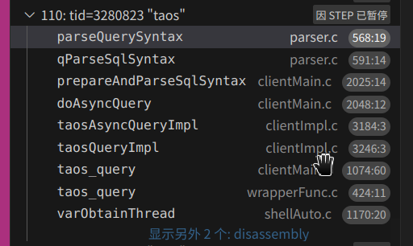
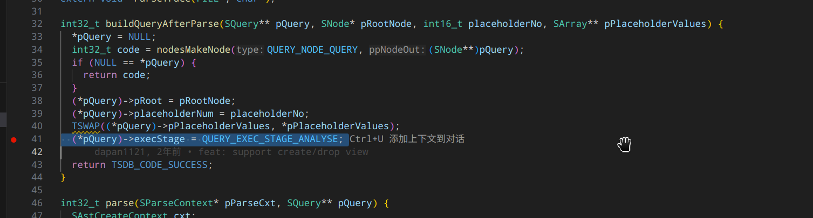
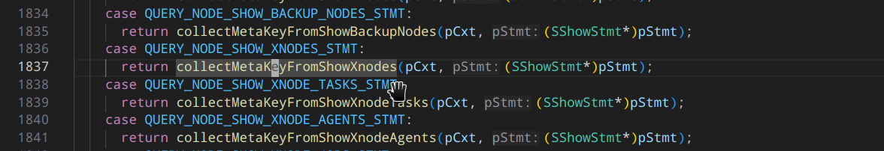
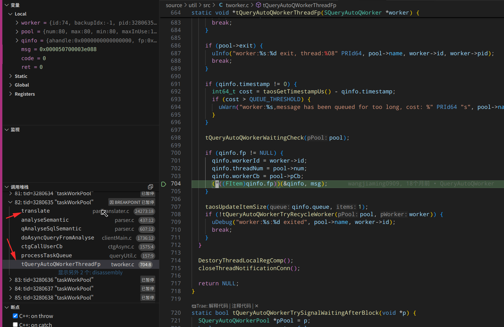
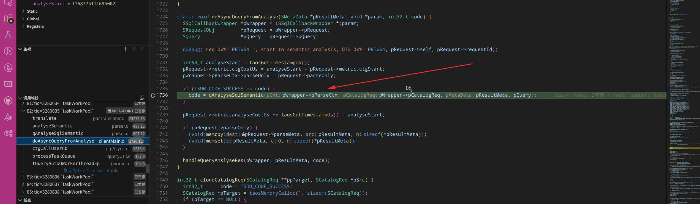
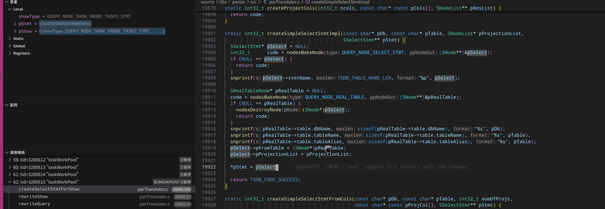

入口：

shellMain.c 的入口 main() -> ... -> shellRunSingleCommandImp() -> client 模块的 taos_query() 方法


taos_query() -> taosAsyncQueryImpl() -> doAsyncQuery() -> prepareAndParseSqlSyntax()

doAsyncQuery() -> prepareAndParseSqlSyntax()   

doAsyncQuery() -> phaseAsyncQuery(()                //这是另外一个分支，这里面没有多少东西


prepareAndParseSqlSyntax() -> qParseSqlSyntax() -> parseQuerySyntax() -> parseSqlSyntax() 

parseSqlSyntax() -> parse()  这里就是真正的解析 sql 的位置


具体断点调用栈：




状态转换：在 parser 以后，进入： (*pQuery)->execStage = QUERY_EXEC_STAGE_ANALYSE;  阶段;




这个函数可以获取到需要的 taosc 侧缓存的表的数据，这样就可以将 show 命令和表数据对应起来了！

```
static int32_t collectMetaKeyFromShowXnodes(SCollectMetaKeyCxt* pCxt, SShowStmt* pStmt) {
  if (pCxt->pParseCxt->enableSysInfo) {
    return reserveTableMetaInCache(pCxt->pParseCxt->acctId, TSDB_INFORMATION_SCHEMA_DB, TSDB_INS_TABLE_XNODES,
                                   pCxt->pMetaCache);
  }
  return TSDB_CODE_SUCCESS;
}
```




#### 这里是异步线程池接收到消息后执行的

从调用 tsem_wait() 开始，就等待异步线程池执行 translate 了; parAstCreater.c 里的东西是在 sql.y 的 Parser 函数里执行的；

tQueryAutoQWorkerThreadFp() 从这里开始，给到这个线程执行这个函数；还没有请求 tsdb ，这里只是处理 shell 发送过来的sql 语句，并进行解析。

注意看这里调用栈：




回调调用语义解析？是的，还没发生 tsdb 请求




translate() -> rewriteQuery() -> rewriteShow() -> 


show 是转为 QUERY_NODE_SELECT_STMT 节点类型的；

走这个:

```
static int32_t translateSelectWithoutFrom(STranslateContext* pCxt, SSelectStmt* pSelect) {
  pCxt->pCurrStmt = (SNode*)pSelect;
  pCxt->currClause = SQL_CLAUSE_SELECT;
  pCxt->dual = true;
  return translateExprList(pCxt, pSelect->pProjectionList);
}
```


setQuery() 函数是在做什么？


将 show 语句转为 select 的 columns, 把show 对应的 sysTableAdapter 里的 元信息 都取出来了，然后拼接为  projections 投影，再进行后续的 select 转换：

```
static int32_t createSimpleSelectStmtFromCols(const char* pDb, const char* pTable, int32_t numOfProjs,
                                              const char* const pProjCol[], SSelectStmt** pStmt) {
  int32_t    code = TSDB_CODE_SUCCESS;
  SNodeList* pProjectionList = NULL;
  if (numOfProjs >= 0) {
    PAR_ERR_RET(createProjectCols(numOfProjs, pProjCol, &pProjectionList));
  }

  return createSimpleSelectStmtImpl(pDb, pTable, pProjectionList, pStmt);
}
```

这里组装 select 语句：




但是 show 只拼接一个列；


