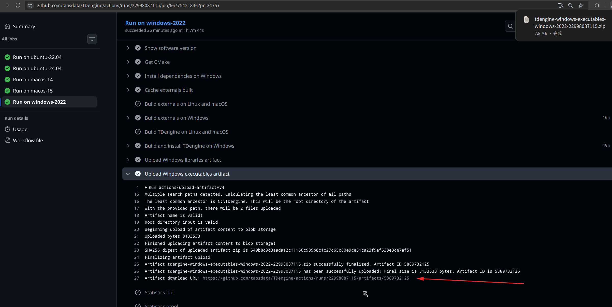

使用 atifacts 下载文件：




TDengine/.github/workflows/tdengine-build.yml 里的配置：

```
    - name: Upload Windows libraries artifact
        if: runner.os == 'Windows'
        uses: actions/upload-artifact@v4
        with:
          name: tdengine-windows-libraries-${{ matrix.os }}-${{ github.run_id }}
          path: |
            C:\TDengine\driver\taos.dll
            C:\TDengine\driver\taosnative.dll
            C:\TDengine\driver\taosws.dll
          retention-days: 7

      - name: Upload Windows executables artifact
        if: runner.os == 'Windows'
        uses: actions/upload-artifact@v4
        with:
          name: tdengine-windows-executables-${{ matrix.os }}-${{ github.run_id }}
          path: |
            C:\TDengine\taos.exe
            C:\TDengine\taosd.exe
          retention-days: 7

```


