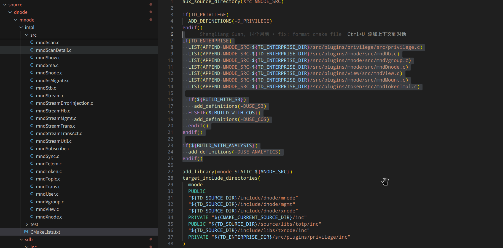

## TDengine

不会编译 go/rust 等库：

```
cd debug
cmake .. -DBUILD_TOOLS=false -DBUILD_KEEPER=false -DBUILD_HTTP=true -DBUILD_TEST=true -DWEBSOCKET:STRING=false
```

编译：

```
 cd debug
 make -j20 install
```


## TDinternal 编译：

```
mkdir /root/TDinternal/debug
cmake .. -DBUILD_TEST=true     # 这一步会先初始化 community, 然后才能进入 community 切换分支

cd /root/TDinternal/community && git checkout feat/zgc-xnode-syntax
cd /root/TDinternal/debug
cmake .. -DBUILD_TEST=true -DGRANT_VALUE=365
或者：
cmake .. -DBUILD_TEST=true -DGRANT_VALUE=365 -DBUILD_SANITIZER=true
make -j20
```

带上 ws 编译：

```
cmake .. -DBUILD_TEST=true -DGRANT_VALUE=365 -DBUILD_TOOLS=true -DBUILD_HTTP=true -DWEBSOCKET:STRING=true

cmake .. -DBUILD_TEST=true -DGRANT_VALUE=365 -DWEBSOCKET:STRING=true
```


忽略部分 warn 报错，企业版编译：

```
make CFLAGS="-Wno-error=stringop-overflow" CXXFLAGS="-Wno-error=stringop-overflow" -j20

cmake .. -DCMAKE_C_FLAGS="-Wno-error=stringop-overflow" -DCMAKE_CXX_FLAGS="-Wno-error=stringop-overflow" -DBUILD_SANITIZER=true
```


```
cmake -B debug -DCMAKE_BUILD_TYPE:STRING=${TD_CONFIG} \
        -DBUILD_TOOLS=true                              \
        -DBUILD_KEEPER=true                             \
        -DBUILD_HTTP=false                              \
        -DBUILD_TEST=true                               \
        -DWEBSOCKET:STRING=true                         \
        -DBUILD_DEPENDENCY_TESTS=false                  \
        -DLOCAL_REPO:STRING=${LOCAL_REPO}               \
        -DLOCAL_URL:STRING=${LOCAL_URL}  

158:
cmake .. -DWEBSOCKET:STRING=true -DBUILD_HTTP=true -DBUILD_SANITIZER=false -DBUILD_TEST=true

local:
cmake .. -DWEBSOCKET:STRING=true -DBUILD_HTTP=true -DBUILD_SANITIZER=true -DBUILD_TEST=true


```


去除一些标记：

```
# 删除所有 CMake 缓存，强制重新配置
cd /app/TDinternal/community
rm -rf build
mkdir build && cd build

# 重新配置并编译
cmake -DCMAKE_C_FLAGS="-Wno-error=stringop-overflow" \
      -DCMAKE_CXX_FLAGS="-Wno-error=stringop-overflow" \
      ..
      
make -j20 install
```


使用 enterprise 的代码覆盖 community 的部分，其实就是分条件编译了，community 和 TDinternal 都有相同的名字，只是按编译条件进行区分：




跑测试用例要开启 LD_PRELOAD, 并且使用 kill 进行杀死：

```
export LD_PRELOAD=/usr/lib/x86_64-linux-gnu/libasan.so.6
unset LD_PRELOAD

跑测试用例的时候，要开启 export LD_PRELOAD=/usr/lib/x86_64-linux-gnu/libasan.so.6


export LD_PRELOAD=/usr/lib/x86_64-linux-gnu/libasan.so.6 taosd
```


