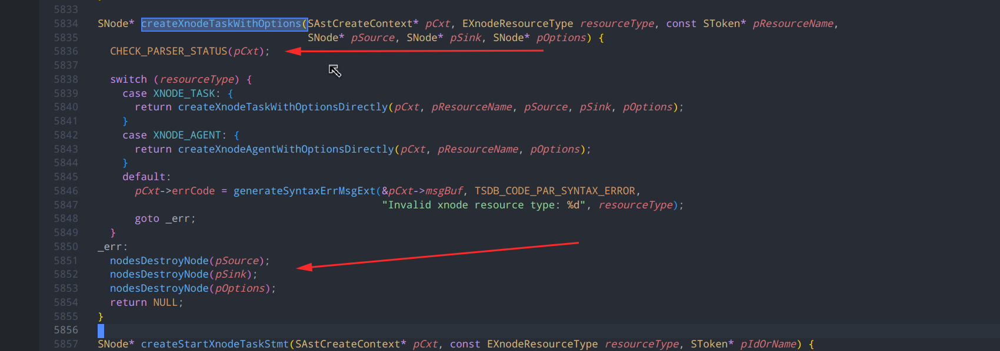
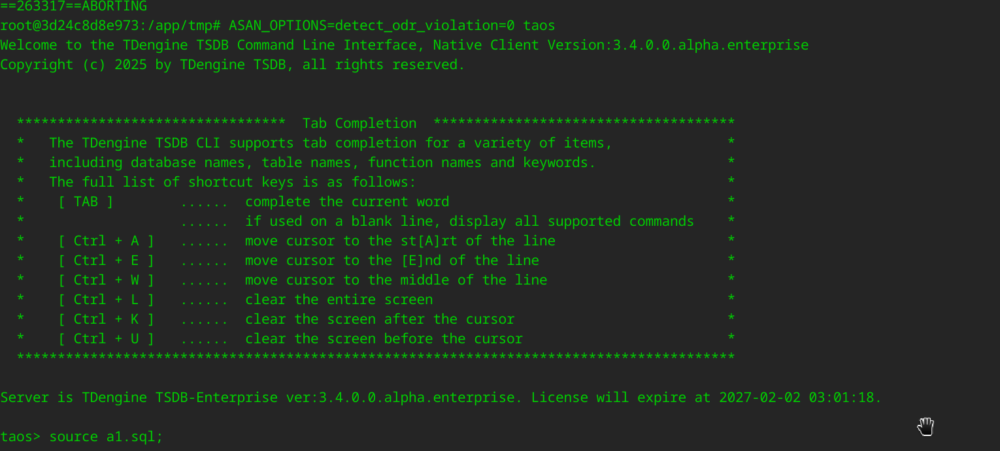

内存泄漏的形式：

1. free(&name);  但是 name 是一个 char *name; 释放的地址就不对
2. 遗漏泄漏：指针数组：char *arr;  arr = calloc(10, sizeof(char *)); 结果只只放了 free(arr[0]); free(arr[1]); ... free(arr[N]); 忘了释放 arr: free(arr); 只释放了内容，没有释放容器！
3. 排查问题：test_xnode.py 的问题，只能一条一条的测试，二分法;  知道哪条 sql 后, 才能顺着入口 sql 继续梳理逻辑，用 gdb 单步调试排除
4. cmd::= 顶级语法的报的语法错误，就需要释放资源：比如 with 等的资源，可能出错了，就没有再执行 资源释放了


parAstCreater.c 里的内存分配：

1. 在 parAstCreater 里赋值，这里是 lemon sql.y  parser 调用的入口函数，一般最顶层的资源 lemon 不会帮你释放，如果是  copy ，就需要释放原资源，如果直接指针传递，就不需要释放
2. 会在 parAstTranslate.c 的 函数里的 pStmt 都是 translate 里的 Query->root， 都会在最后被框架释放掉！


为什么每个 parAstCreater.c 里的函数都先执行：

CHECK_PARSER_STATUS(pCxt);

```
SNode* createXnodeTaskWithOptions(SAstCreateContext* pCxt, EXnodeResourceType resourceType, const SToken* pResourceName,
                                  SNode* pSource, SNode* pSink, SNode* pOptions) {
  CHECK_PARSER_STATUS(pCxt);
...
}
```

因为在类似：

```
create xnode task 'zgc' from 'abc' to '111' with parser '{parser_json}';

语法：
/* create xnode task 't1' from 'mqtt://xxx' to database s1 with parser '{...}' */
cmd ::= CREATE XNODE xnode_resource_type(A) NK_STRING(B) FROM xnode_task_source(C) TO xnode_task_sink(D) with_task_options_opt(E).                            { pCxt->pRootNode = createXnodeTaskWithOptions(pCxt, A, &B, C, D, E); }
```

如果 `with parser '{parser_json}'` 语句出错了，那么前面的 from, to 的语句的内容也需要释放，这种已经生产执行过的语句，只有进入了顶层的 createXnodeTaskWithOptions 才会释放！

比如：




客户端 taos ：

使用这种方式更方便测试出漏洞：

```
ASAN_OPTIONS=detect_odr_violation=0 taos -f a1.sql
```

等价于使用 source a1.sql




```
      if (pOptions->parser) {
        taosMemFreeClear(pOptions->parser);
      }
      pOptions->parser = taosMemoryCalloc(1, pOptions->parserLen + 1);
```


