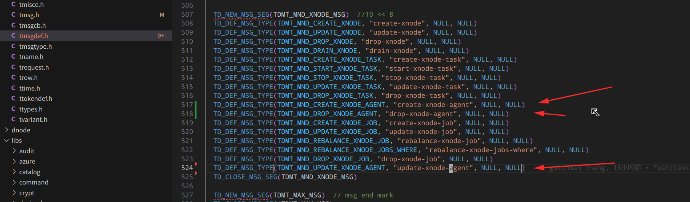
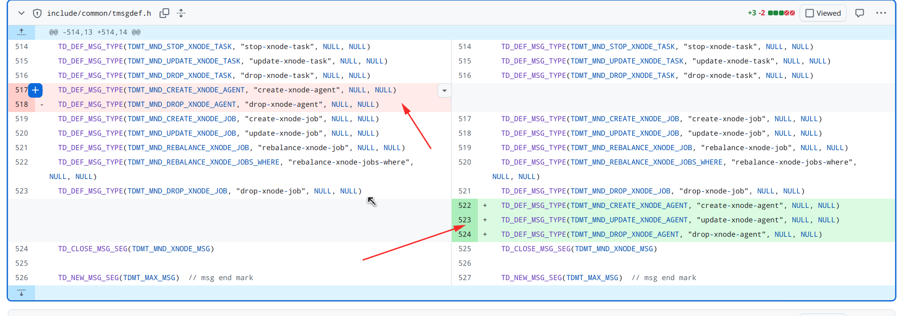

tsdb 里消息必须按照顺序写的地方：

1. tmsgdef.h 里的消息顺序是不能乱动的：

因为没有固定写 名称 = 1,2,3 等这样的形式，上一版本顺序乱了和下一版本顺序不一致，如果用户只升级了 taosd ， 而没有升级客户端，就很容易导致 消息错乱了！并且 bug 不容易排查！

改成：

下面这种改是不允许的：

https://github.com/taosdata/TDengine/pull/34263/changes#diff-117fa1abd9463ea3fc5c0b940b01c15e1c71206402c055142adec5f829c8aa4b

2. 错误码也是不可以乱改顺序的，只能追加，因为其他的服务都依赖这些错误码！

3. 几乎所有的 枚举值 都不可以改 顺序！！ 因为生态依赖！！

   

