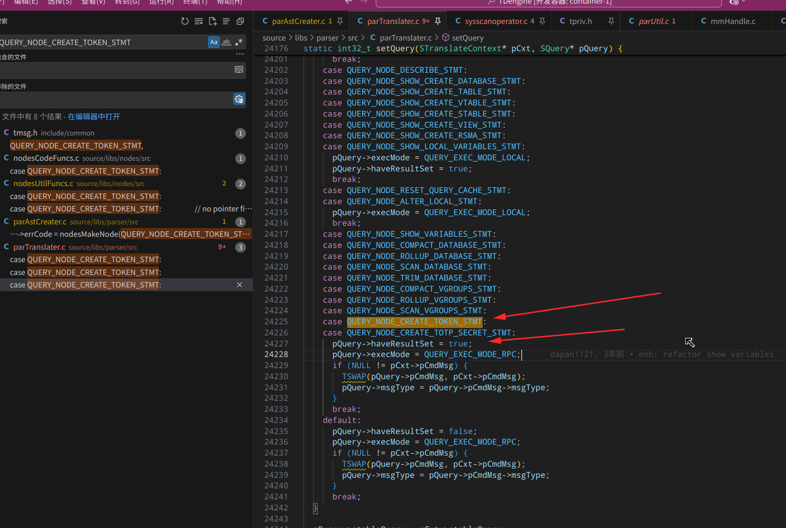
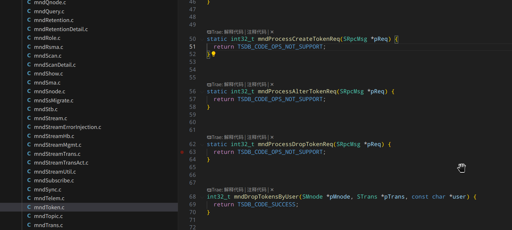

当前 CREATE XNODE 时，需要用户名和密码，不方便用户使用，阻塞自动初始化，当用户修改密码时也无法自动更新，创建 XNODE 时，允许指定用户，xnoded 使用指定用户或当前用户的 TOKEN 作为认证方式。

## 逻辑梳理

3 种语法迭代：

```
CREATE XNODE 'url' USER name PASS 'password'
CREATE XNODE 'url' TOKEN 'token'
CREATE XNODE 'url'
```

第3种，如果没有指定 token, 就使用创建 xnode 使用的 token

第 2，3 种使用 token;

第一种是否使用 token ？ 怎么创建 token ? 因为涉及到用户名密码转 token 的问题。

当前讨论后继续使用 用户名/密码 访问。


完整：

```
CREATE XNODE 'url' USER name PASS 'password'
CREATE XNODE 'url' TOKEN 'token'
CREATE XNODE 'url'

alter XNODE {id | 'url'} with/set token 'token';
alter XNODE {id | 'url'} with/set USER name PASS 'password';

应该是：
alter XNODE set token 'token';
alter XNODE set USER name PASS 'password';

__xnode__, root  extra_info 说明使用

drop 最后一个 xnode 目前不删除 __xnode__, root


__xnode_task_${id}__
drop task 删除对应的 __xnode_task_${id}__, name


xnode 的 labels "name,n2=x1,n3"; //todo, 当前支持 alter set 语句，可以对 labels 进行支持
```

2. 同理：xnode agent 支持 alter set


show tokens 的 name 是惟一的：

```
taos> show tokens;
              name              |            user            |            provider            | enable |       create_time       |       expire_time       |           extra_info           |
=============================================================================================================================================================================================
 zgc                            | root                       |                                |      1 | 2026-01-22 10:22:30.000 | 1970-01-01 00:00:00.000 |                                |
 abc                            | root                       |                                |      1 | 2026-01-22 09:01:36.000 | 1970-01-01 00:00:00.000 |                                |
Query OK, 2 row(s) in set (0.009148s)
```

重复创建报错：

```
taos> show tokens;
              name              |            user            |            provider            | enable |       create_time       |       expire_time       |           extra_info           |
=============================================================================================================================================================================================
 abc                            | root                       |                                |      1 | 2026-01-22 09:01:36.000 | 1970-01-01 00:00:00.000 |                                |
Query OK, 1 row(s) in set (0.008005s)

taos> create token abc from user root;

DB error: Token already exist [0x8000034A] (0.001561s)
```


问题：

1. create task to database 这样的 task 的时候，是要增加 token 的，这样的 token 怎么传递给 xnoded ? start 的请求参数上带上
2. token  有校验吗？ token 怎么验证权限？token 和权限的关系是啥？
3. 


设计：

1. 没有指定用户名和密码，也没有指定 token 的时候，就使用创建的 token

2. create task to database 这样的 task 的时候，是要增加 token 的
   1. 这样的 token 怎么传递给 xnoded ? start 的请求参数上带上

3. token 保存起来，可以更新：
   1. token 走创建流程：创建完，在 cached 里再获取即可
   2. token 保存
   3. token 更新

4. token 更新和 user/pass 更新需要重启 xnoded

5. task 的 database 的操作, 优先级较低，暂时不做了：

    ```
    __xnode_task_${id}__ 
    
    drop task 删除对应的 __xnode_task_${id}__, name 
    
    alter xnode task to database 'abc';
    ```

   设计增加和删除两个操作：

   1. 增加需要指定名称
   2. 删除对应 task 前需要判断 dataType == DATABASE, 如果是 DATABASE, 就需要删除对应的 token 标记
   3. alter set  to 更新 to 如果是 database 也需要更新  to 的 dsn, 因为是 to dsn 是组装的

   


## todo:

1. 使用 alter 更新 token 和 user/pass 后，都需要更新
2. 创建 task 的时候，如果使用的是 to database 模式，需要创建临时 token, 
3. drop 对应 to database 类型的 task 时，删除对应的 token 记录：__xnode_task_${id}__, name


## 测试case

1. 创建 create xnode 'url' user pass
2. 创建 create xnode 'url' token
3. create xnode 'url'
4. alter xnode set user root pass 'taosdata'
5. alter xnode set token 'abc'
6. create xnode 'url'; -> 修改 alter 为 user pass -> xnoded 是否重启生效 -> 修改为 token -> xnoded 是否重启生效
7. create xnode 'url'; -> 修改 alter 为 token ->  xnoded 是否重启生效 -> 修改为 user pass ->  xnoded 是否重启生效
8. 


## 开发测试命令

asan 的启动命令：

```
LD_PRELOAD=/usr/lib/x86_64-linux-gnu/libasan.so.6 taosd
```


## xnode 使用 token 

当前 token 命令：

```
taos> create token abc from user root;
                              token                              |
==================================================================
 Rs8oVc6RkZ90kc0697m9ehzaJkqKmYvIQ8WRi11qCLQRXumhy73wi0ym29x68W5 |
Query OK, 1 row(s) in set (0.010666s)
```


注意这里 create 是有返回的，是在 parTranslate.c 里实现的：




权限不支持社区版，如果是社区版，就报错：

```
taos> create token abc from user root;

DB error: Operation not supported [0x80000100] (0.002471s)
taos> 
```




## ai prompt

```
在 kimi 目录下有 FS.md 和 TS.md，这两个文件是模板文件，我需要你根据当前项目 community 的这2个commit: 21b5986e29c94448995fadccc03ab83649dae242, d57ad4819e14bab2f870d250a0e78b886d48facb 里的代码内容，产生两个新的 FS.md 和 TS.md。
这个 commit: 21b5986e29c94448995fadccc03ab83649dae242 实现的功能是：
1. 创建 xnode 的时候，如果没有指定用户名密码，就创建默认的 token
2. 支持用户名和密码的修改：alter XNODE set token 'token' 和 alter XNODE set USER name PASS 'password'， 修改的 token 和用户名密码会后，会重启 xnoded 节点
```


## 总结

1. show 的 BLOB 总长度 限制是 64k, 即所有的字段的长度的和加起来不超过 64k
2. 


