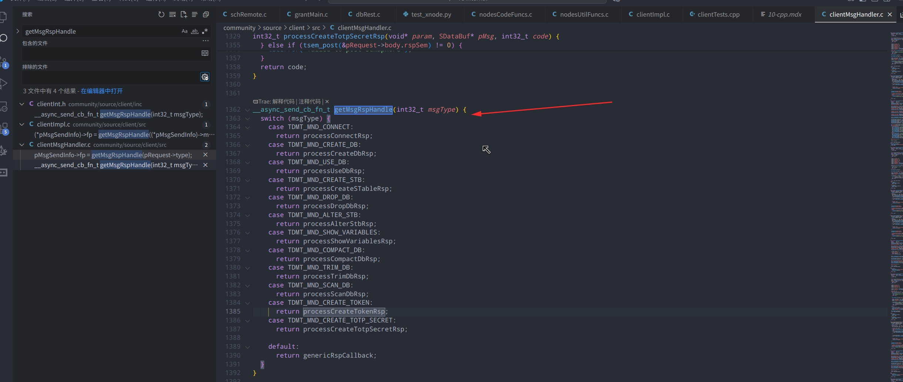

## 分析

1. 都是处理成功的结果，失败的结果没有处理
2. clientImpl.c 里的应该是底层先处理 pMsg 的消息，转为其他的结构体，然后在处理后续的！
3. 所以：应该找到后续怎么处理 错误 的模块！


```
 TDengine 错误码传递流程完整分析

  1. 服务端产生错误 (mndXnode.c)

  在 source/dnode/mnode/impl/src/mndXnode.c 第 1658-1706 行，mndProcessCreateXnodeTaskReq 函数处理创建 xnode task 请求：

  static int32_t mndProcessCreateXnodeTaskReq(SRpcMsg *pReq) {
    // ...
    //xxxzgc for test
    int32_t contLen = 64;
    void *pRsp = rpcMallocCont(contLen);
    pReq->info.rspLen = contLen;
    pReq->info.rsp = pRsp;
    snprintf(pReq->info.rsp, contLen, "xxxzgc: create xnode task:%s", createReq.name.ptr);
    code = TSDB_CODE_MND_XNODE_HTTP_CODE_ERROR;  // 错误码
    goto _OVER;
    // ...
  _OVER:
    tFreeSMCreateXnodeTaskReq(&createReq);
    TAOS_RETURN(code);  // 返回错误码
  }

  关键问题：这里虽然设置了 pReq->info.rsp（响应数据），但 RPC 层主要传递的是 code（错误码）。

  ──────────────────────────────────────────────────────────────────────────────────────────────────────────────────────────────────────────────────────────────────────────────────────────────────────────
  2. 客户端接收响应 (clientMsgHandler.c)

  在 source/client/src/clientMsgHandler.c 第 1361-1395 行，processCreateXnodeTaskRsp 函数处理响应：

  int32_t processCreateXnodeTaskRsp(void* param, SDataBuf* pMsg, int32_t code) {
    SRequestObj* pRequest = param;
    printf("\nxxxzgc *** print create xnode task rspLen: %d, rsp:%s\n", pMsg->len, (char*)pMsg->pData);
    if (code != TSDB_CODE_SUCCESS) {
      setErrno(pRequest, code);  // 第 1366 行：只设置了错误码
    } else {
      // 成功处理...
    }
    // ...
  }

  第 1366 行的 setErrno 函数（第 35-38 行）：

  static void setErrno(SRequestObj* pRequest, int32_t code) {
    pRequest->code = code;    // 保存错误码到请求对象
    terrno = code;            // 保存到线程局部变量
  }

  ──────────────────────────────────────────────────────────────────────────────────────────────────────────────────────────────────────────────────────────────────────────────────────────────────────────
  3. 客户端错误码转字符串 (clientMain.c)

  在 source/client/src/clientMain.c 第 980-1000 行，taos_errstr 函数将错误转换为字符串：

  const char *taos_errstr(TAOS_RES *res) {
    // ...
    SRequestObj *pRequest = (SRequestObj *)res;

    // 检查是否有动态错误消息
    if (NULL != pRequest->msgBuf && (strlen(pRequest->msgBuf) > 0 || pRequest->code == TSDB_CODE_RPC_FQDN_ERROR)) {
      return pRequest->msgBuf;  // 返回动态错误消息
    } else {
      return (const char *)tstrerror(pRequest->code);  // 使用静态错误码映射表
    }
  }

  ──────────────────────────────────────────────────────────────────────────────────────────────────────────────────────────────────────────────────────────────────────────────────────────────────────────
  4. 静态错误码映射表 (terror.c)

  在 source/util/src/terror.c 中定义了所有错误码和字符串的映射：

  typedef struct {
    int32_t     val;    // 错误码值
    const char* str;    // 错误描述字符串
    const char* macro;  // 错误宏名称
  } STaosError;

  // 错误码定义示例
  TAOS_DEFINE_ERROR(TSDB_CODE_MND_XNODE_HTTP_CODE_ERROR, "Xnode http code error")
  // ...

  tstrerror 函数（第 1189-1227 行）通过二分查找在 errors 数组中找到对应的字符串：

  const char* tstrerror(int32_t err) {
    // ...
    while (s < e) {
      int32_t mid = (s + e) / 2;
      if (err == errors[mid].val) {
        return errors[mid].str;  // 返回预定义的静态字符串
      }
      // ...
    }
    return "";
  }

  ──────────────────────────────────────────────────────────────────────────────────────────────────────────────────────────────────────────────────────────────────────────────────────────────────────────
  5. Shell 显示错误 (shellEngine.c)

  在 tools/shell/src/shellEngine.c 第 1135-1139 行：

  void shellPrintError(TAOS_RES *tres, int64_t st) {
    int code = taos_errno(tres);
    int64_t et = taosGetTimestampUs();
    printf("\r\nDB error: %s [0x%08X] (%.6fs)\r\n", taos_errstr(tres), code, (et - st) / 1E6);
    // ...
  }

  ──────────────────────────────────────────────────────────────────────────────────────────────────────────────────────────────────────────────────────────────────────────────────────────────────────────
  总结：当前限制与改进建议

  当前流程的问题

  Server 端 (mndXnode.c)
      ↓
  设置 pReq->info.rsp = "xxxzgc: create xnode task:xxx"  ← 这个响应数据只在成功时有效
  设置 code = TSDB_CODE_MND_XNODE_HTTP_CODE_ERROR
      ↓
  RPC 传输
      ↓
  Client 端 (clientMsgHandler.c:1366)
      ↓
  setErrno(pRequest, code)  ← 只传递了错误码，错误消息丢失！
      ↓
  taos_errstr() 调用 tstrerror(code)  ← 返回静态字符串 "Xnode http code error"
      ↓
  Shell 显示 "DB error: Xnode http code error [0x80000236]"

  要实现动态错误消息传递，需要修改：

  1. 定义新的响应结构体（包含错误码和错误消息），或复用 pRequest->msgBuf
  2. 在 processCreateXnodeTaskRsp 中解析服务端返回的错误消息并写入 pRequest->msgBuf：

  // 建议修改：
  if (code != TSDB_CODE_SUCCESS) {
      setErrno(pRequest, code);
      // 将服务端返回的错误消息复制到 msgBuf
      if (pMsg->pData && pMsg->len > 0) {
          tstrncpy(pRequest->msgBuf, (char*)pMsg->pData, pRequest->msgBufLen);
      }
  }

  3. 或者修改 RPC 层，在错误响应中也携带详细错误信息（不只是错误码）

  ──────────────────────────────────────────────────────────────────────────────────────────────────────────────────────────────────────────────────────────────────────────────────────────────────────────
  核心结论：当前架构中，server 端只能传递错误码（int32），无法直接传递动态字符串错误消息。要实现动态错误消息，必须将错误消息写入 pRequest->msgBuf，这样 taos_errstr 会优先返回 msgBuf 中的内容而不是查找静态
  映射表。
```


参考此图里的工程：




### 测试代码

mndXnode.c 里的代码：

```
static int32_t mndProcessCreateXnodeTaskReq(SRpcMsg *pReq) {
  mDebug("xnode create task request received, contLen:%d\n", pReq->contLen);
  SMnode              *pMnode = pReq->info.node;
  int32_t              code = 0;
  SMCreateXnodeTaskReq createReq = {0};

  //xxxzgc for test
  int32_t contLen = 64;
  void *pRsp = rpcMallocCont(contLen);
  if (pRsp == NULL) {
    TAOS_CHECK_GOTO(terrno, NULL, _OVER);
  }
  pReq->info.rspLen = contLen;
  pReq->info.rsp = pRsp;
  snprintf(pReq->info.rsp, contLen, "xxxzgc: create xnode task:%s", createReq.name.ptr);
  code = TSDB_CODE_MND_XNODE_HTTP_CODE_ERROR;
  goto _OVER; 
```


## 总结

1. rpcRsp 里的消息确实都是通过 SRpcMsg 里的 rsp 和 rspLen 控制返回的，rpc 消息是有返回的
2. 


## 其他

tsdb 一大抄！

就是找已经有了的类似功能进行抄就行！


